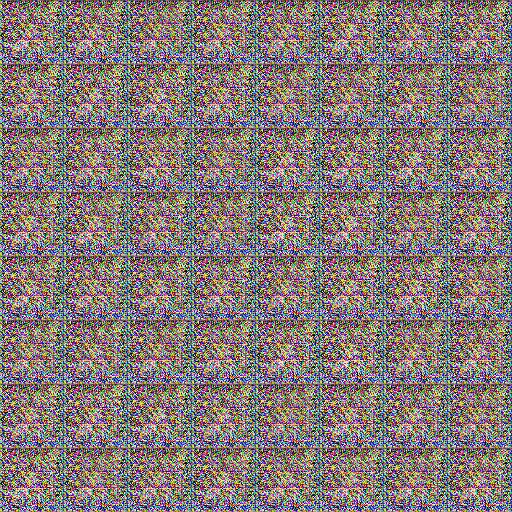

# Simple GAN: Cat Face Generation


A **Generative Adversarial Network (GAN)** is a class of machine learning frameworks consists of two neural networks, the **Generator** and the **Discriminator**, which are trained simultaneously through adversarial processes.

- **Generator**: This network generates new data instances that resemble the training data.
- **Discriminator**: This network evaluates the data instances and tries to distinguish between real data (from the training set) and fake data (created by the generator).

The goal of the generator is to produce data so realistic that the discriminator cannot tell it apart from real data, while the discriminator aims to get better at distinguishing real from fake data. This adversarial process continues until the generator produces highly realistic data.

# Dataset
The source files of dataset can be found in [kaggle](https://www.kaggle.com/datasets/spandan2/cats-faces-64x64-for-generative-models)


## Training Result
| Generator Loss      | Discriminator Loss       |
|----------------|----------------|
|   |   |

## Demo

Below is a GIF demonstrating the fake images created by the Generator network:



*As can be seen, Over hundreds of iterations, the `Generator` is learning the critifial features of a cat face*


### Installation

```bash
  git clone https://github.com/hamid-mp/Computer-Vision-Projects.git
  
  cd Computer-Vision-Projects/simple-GAN
  
  pip install -r requirements.txt
```
### Train
Training Parameters can be tuned in `configs.yaml` file
```bash
python main.py
```

## Authors

- [@HamidMP](https://github.com/hamid-mp)

